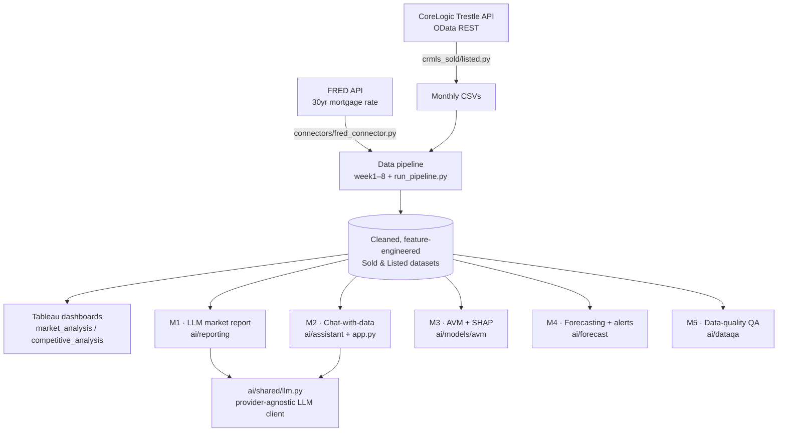

# AI-Augmented Real Estate Market Intelligence Platform


End-to-end analytics platform over **CRMLS California residential** MLS data
(28 months, ~350K closed sales). It ingests data from live APIs, runs a
reproducible 16-stage cleaning/feature pipeline, and layers five AI modules on
top — an LLM market-report writer, a natural-language data assistant, an
explainable home-valuation model, a forecaster, and a data-quality agent — plus
interactive Tableau dashboards.

> Built during a data-analyst internship and extended into an **AI-augmented**
> analytics project: AI is used as a force-multiplier for analysis and
> reporting (auto-narration, self-serve querying, decision-support modeling),
> with deterministic code doing the math and LLMs doing the language.

**Confidentiality:** the underlying MLS data is confidential and is **not**
included in this repo (CSVs, `.twbx`, SQL extracts, and the API extraction
scripts are gitignored). All AI calls can run **fully locally** (Ollama), so
confidential data never leaves the machine.

---

## Results at a glance

| Module | What it does | Result |
|---|---|---|
| **M1** LLM report | Auto-writes statewide + per-county market commentary | Fact-sheet prompting → grounded, zero-fabrication narratives |
| **M2** Chat-with-data | NL question → DuckDB SQL → answer | SELECT-only safety layer; small local model writes correct SQL |
| **M3** AVM + SHAP | Explainable home valuation (leakage-free) | **R² 0.875, median APE 8.5%** on a whole-month forward-in-time split |
| **M4** Forecasting | 3-month SARIMAX forecast + alerts | Backtest **MAPE 2.4%** (price) |
| **M5** Data quality | Rules + IsolationForest anomaly detection | 414K records; **25 anomalies the rules missed** |

Plus: a live **FRED REST API** connector, a **16-stage** orchestrated pipeline,
a 1-page market-intelligence brief, unit tests + CI, and Tableau dashboards.

---

## Architecture



---

## AI modules

### M1 · LLM market-report generator  ·  `ai/reporting/market_narrative.py`
Replaces hand-written market commentary. Computes monthly KPIs
(MoM/YoY/peak/supply-demand), feeds the LLM a **pre-labelled fact sheet**
(so small models don't misread MoM vs YoY or signs), and gets back a structured
`{headline, summary, watch[]}` narrative that is embedded into the EDA report.
Falls back to a deterministic stub if no LLM is available.

```bash
.venv/bin/python eda_report.py                    # statewide report with an auto "AI 市场综述" section
.venv/bin/python ai/reporting/county_reports.py   # fan out: one AI report per top-N county
```
The fan-out is the real leverage of LLM reporting — a human can hand-write one
market summary, but not 60 every month; this generates one per county into a
polished HTML report (`outputs/county_reports.html`).

### M2 · Chat-with-data (text-to-SQL)  ·  `ai/assistant/text_to_sql.py` + `app.py`
Lets non-technical stakeholders query the data in plain language. The LLM writes
**DuckDB SQL** against the sold table; a safety layer allows only a single
`SELECT` (DDL/DML rejected) and wraps every query in an outer `LIMIT`. A
Streamlit UI shows the generated SQL, a result table, an auto chart, and a CSV
export.

```bash
.venv/bin/streamlit run app.py
.venv/bin/python eval/text2sql_eval.py   # gold-labelled accuracy eval (below)
```

**Honest evaluation.** Text-to-SQL is error-prone, so `eval/text2sql_eval.py`
scores it properly: a gold-labelled question set, 3 trials each, with
result-set matching against a hand-written gold query (Spider/BIRD-style
execution accuracy). Measured **execution accuracy: 50% (qwen2.5:3b) vs 75%
(qwen2.5:7b)** — the bigger local model is the default, but even it gets a
quarter wrong (some silently), which is exactly why the UI **always shows the
generated SQL** and the guard is read-only. A frontier model (Claude) via the
provider switch would score higher still.

### M3 · AVM home-valuation model + SHAP  ·  `ai/models/avm/train_avm.py`
An explainable pricing decision-support model. XGBoost predicts `ClosePrice`
from **leakage-free** features (size, year, lot, garage, lat/lon, county,
sub-type, amenities, mortgage rate) — deliberately excluding `ListPrice`,
`price_per_sqft`, `DaysOnMarket`, etc. SHAP surfaces the top value drivers.

```bash
.venv/bin/python ai/models/avm/train_avm.py    # writes metrics + SHAP plot to outputs/
```
Test performance: **R² ≈ 0.875, median APE ≈ 8.5%, ~57% of predictions within
±10%**. Top SHAP drivers: **longitude, latitude, living area** — i.e. location
and size. (Good-but-not-perfect metrics confirm the model is leakage-free.)

### M4 · Market forecasting + alerting  ·  `ai/forecast/forecast_market.py`
Forecasts monthly **median close price** and **closed sales** 3 months ahead
with SARIMAX (80% confidence intervals), backtests accuracy on a holdout, and
raises a deviation alert when the latest month falls outside expectation. Uses a
seasonal-AR model so the intervals stay realistic on the short (~28-month)
series. Backtest MAPE: price ≈ 2.4%, sales ≈ 12.7%.

```bash
.venv/bin/python ai/forecast/forecast_market.py   # writes forecast.png + forecast.json to outputs/
```

### M5 · Automated data-quality agent  ·  `ai/dataqa/data_quality.py`
A standalone QA report over the flagged dataset: missing-value analysis, a
rule-flag summary, and **IsolationForest** multivariate anomaly detection that
surfaces records which pass every rule but are anomalous in combination (e.g. a
100-sqft "BoatSlip" priced like a home). Rules catch what you check for; the
model catches what you didn't.

```bash
.venv/bin/python ai/dataqa/data_quality.py        # writes data_quality.html to outputs/
```

M1 and M2 share one **provider-agnostic LLM client** (`ai/shared/llm.py`):
switch between a local model and a cloud API with one env var, no code change.
(M3–M5 are pure deterministic ML — no LLM dependency, which is by design.)

---

## Data pipeline

A 16-stage pipeline keeps the Sold and Listed chains in sync and regenerates
every downstream artifact; run it whenever a new month of raw data is added:

```bash
.venv/bin/python run_pipeline.py            # full pipeline
.venv/bin/python run_pipeline.py --from week6   # resume from a stage
.venv/bin/python run_pipeline.py --list     # list stages
```

Stages: monthly concat + Residential filter → EDA/validation + **FRED mortgage
rate enrichment** → cleaning + date/geo checks → feature engineering → IQR
outlier flagging → Tableau prep → EDA report → per-county AI reports → AVM →
forecast → data-quality. The LLM stages degrade to a deterministic stub if no
model is available, so the pipeline never breaks on a missing model.

## Tests

```bash
.venv/bin/python -m pytest tests/ -q        # also run in CI on every push
```
Unit tests cover the SQL safety guard, the calendar-month MoM/YoY logic, the
AVM leakage exclusion, and JSON parsing — and run without the (gitignored) data
or heavy libraries.

---

## Tech stack

`Python` · `pandas` / `numpy` · `DuckDB` · `XGBoost` · `SHAP` · `scikit-learn`
· `Streamlit` · `Anthropic Claude` / `Ollama (local LLM)` · `matplotlib` ·
`Tableau Public` · live REST APIs (`CoreLogic Trestle`, `FRED`)

---

## Setup

```bash
# 1. Python env (use the venv's python, not a system/brew python)
/usr/bin/python3 -m venv .venv
.venv/bin/pip install -r requirements.txt

# 2. (Optional) free local LLM for M1/M2
brew install ollama libomp        # libomp is also required by xgboost on macOS
brew services start ollama
ollama pull qwen2.5:7b            # 7b > 3b on text-to-SQL (see eval/); 3b is a faster fallback

# 3. Config — copy and fill in
cp .env.example .env              # set LLM_PROVIDER, optional API keys
```

`.env` keys: `LLM_PROVIDER` (`ollama` | `anthropic` | `stub`), `OLLAMA_MODEL`,
`ANTHROPIC_API_KEY`, `FRED_API_KEY`. `.env` is gitignored — never commit secrets.

---

## Project structure

```
.
├── connectors/fred_connector.py     # FRED REST API connector (key auth, JSON)
├── ai/
│   ├── shared/llm.py                # provider-agnostic LLM client
│   ├── reporting/                   # M1 narrative engine, fan-out & brief
│   │   ├── market_narrative.py      #   M1  — statewide LLM market report
│   │   ├── county_reports.py        #   M1+ — per-county fan-out
│   │   └── market_brief.py          #   capstone 1-page intelligence brief
│   ├── assistant/text_to_sql.py     # M2 — NL → DuckDB SQL
│   ├── models/avm/train_avm.py      # M3 — AVM + SHAP
│   ├── forecast/forecast_market.py  # M4 — SARIMAX forecasting + alerts
│   └── dataqa/data_quality.py       # M5 — data-quality + anomaly detection
├── app.py                           # M2 — Streamlit chat-with-data UI
├── eda_report.py                    # self-contained HTML EDA report (embeds M1)
├── run_pipeline.py                  # 16-stage pipeline orchestrator
├── week{1..8}_*.py                  # pipeline stages (Sold & Listed chains)
├── tests/ · .github/workflows/ci.yml  # unit tests + CI
├── eval/text2sql_eval.py            # gold-labelled text-to-SQL accuracy eval
├── requirements.txt · .env.example · AI_ROADMAP.md
└── (gitignored) data/  *.csv  *.twbx  *.sql  crmls_*.py  .env  .venv  outputs/
```

---

## Skills demonstrated

Live API integration (REST, OAuth-style token auth, JSON, pagination) ·
reproducible data pipelines · feature engineering · data-quality / outlier
handling · **LLM application development** (prompt engineering, structured
output, local + cloud backends, graceful degradation) · **text-to-SQL** ·
**explainable ML** (XGBoost + SHAP, leakage control) · **time-series
forecasting** (SARIMAX, backtesting) · BI dashboards (Tableau) · secrets hygiene.

> See [`AI_ROADMAP.md`](AI_ROADMAP.md) for the module plan and remaining work.
